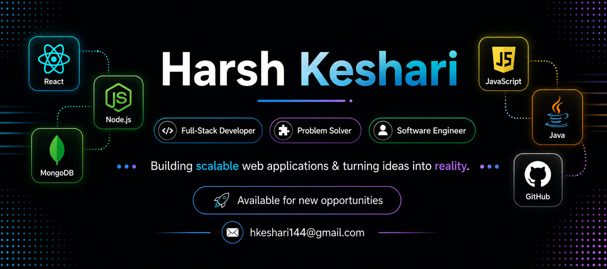

  

# 💫 About Me:
### 👨‍💻 Full Stack Developer  - 🔭 I’m currently working on **MERN Stack Projects**  - 🌱 I’m currently learning **AI Integration**  - 💬 Ask me about **Java & MERN Stack**  - ⚡ Fun fact — **I love turning ideas into working projects 🚀**  - 📫 How to reach me — [**LinkedIn**](https://www.linkedin.com/in/harshkeshari14/) • **Email : hkeshari144@gmail.com**

## 🌐 Socials:
  

# 💻 Tech Stack:
                      
# 📊 GitHub Stats:
 
 

